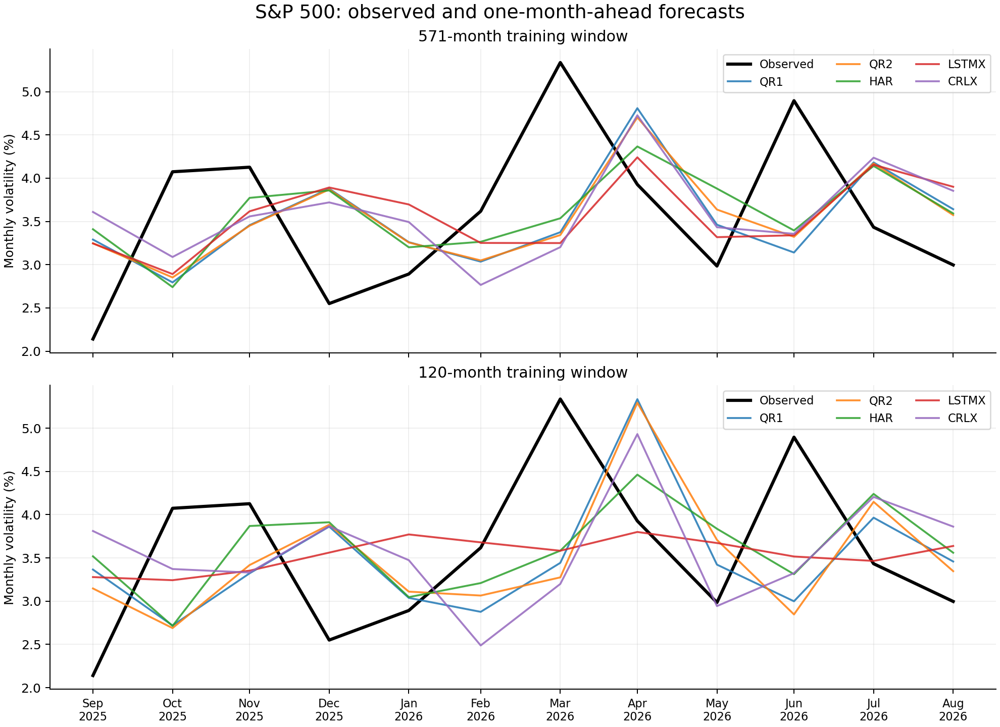
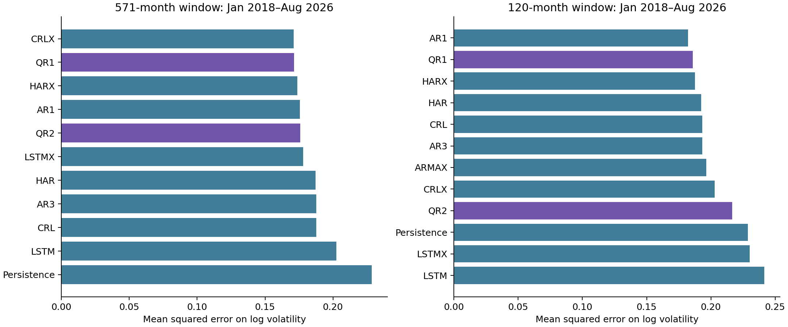

# Current-market quantum reservoir results

Evaluation: **2018-01-31 through 2026-08-31**. Final-year case study: **2025-09 through 2026-08**.

## Results

Models below have every required scored prediction. Results average losses across seeds; seeds are not extra market observations. ARMAX or other incomplete results are reported separately, with a common-date comparison where available.

**571-month window:** CRLX has the lowest mean log-RV MSE (0.17098). QR1 MSE is 8.4% lower than HAR. QR2 MSE is 5.9% lower than HAR.

**120-month window:** AR1 has the lowest mean log-RV MSE (0.18236). QR1 MSE is 3.4% lower than HAR. QR2 MSE is 12.5% higher than HAR.

### Final-year interpretation

With 571 months of training, **HAR** has the lowest final-year log-RV MSE (0.08551). QR1: 0.09424. QR2: 0.08891.

With 120 months of training, **LSTMX** has the lowest final-year log-RV MSE (0.06770). QR1: 0.10371. QR2: 0.11147.

The quantum models are competitive in the longer retrospective comparison, but neither has the lowest error in the final twelve months. The reported MCS results do not establish a uniquely superior quantum model. Differences across the two training windows describe this fixed experiment and do not justify selecting a window after observing the final year.

### post2017

| window | model | mse_log_rv | mae_log_rv | qlike_variance | directional_accuracy | mse_seed_std |
| --- | --- | --- | --- | --- | --- | --- |
| 120 | AR1 | 0.18236 | 0.326282 | 0.72663 | 0.701923 | 0 |
| 120 | QR1 | 0.18587 | 0.33053 | 0.667172 | 0.653846 | 0.00257926 |
| 120 | HARX | 0.187691 | 0.328874 | 0.671819 | 0.682692 | 0 |
| 120 | HAR | 0.192466 | 0.33334 | 0.821286 | 0.653846 | 0 |
| 120 | CRL | 0.193196 | 0.333962 | 0.79878 | 0.653846 | 0.000108096 |
| 120 | AR3 | 0.193255 | 0.333939 | 0.800531 | 0.653846 | 0 |
| 120 | ARMAX | 0.196522 | 0.347109 | 0.65481 | 0.653846 | 0 |
| 120 | CRLX | 0.202915 | 0.348296 | 0.757332 | 0.634615 | 0.00678295 |
| 120 | QR2 | 0.216499 | 0.355652 | 0.766599 | 0.646154 | 0.00426827 |
| 120 | Persistence | 0.228674 | 0.378301 | 0.718946 | 0.0673077 | 0 |
| 120 | LSTMX | 0.230279 | 0.356291 | 1.17468 | 0.676923 | 0.0017752 |
| 120 | LSTM | 0.241656 | 0.366987 | 1.21302 | 0.659615 | 0.0026659 |
| 571 | CRLX | 0.170985 | 0.319831 | 0.609408 | 0.648077 | 0.001523 |
| 571 | QR1 | 0.171392 | 0.316781 | 0.595298 | 0.657692 | 0.000509451 |
| 571 | HARX | 0.173748 | 0.316407 | 0.651397 | 0.644231 | 0 |
| 571 | AR1 | 0.175715 | 0.325133 | 0.591646 | 0.682692 | 0 |
| 571 | QR2 | 0.17602 | 0.320737 | 0.632227 | 0.659615 | 0.00205254 |
| 571 | LSTMX | 0.178195 | 0.320938 | 0.672357 | 0.663462 | 0.00510516 |
| 571 | HAR | 0.187128 | 0.329459 | 0.726565 | 0.644231 | 0 |
| 571 | AR3 | 0.187819 | 0.330074 | 0.705361 | 0.663462 | 0 |
| 571 | CRL | 0.187854 | 0.329907 | 0.706445 | 0.673077 | 7.64126e-05 |
| 571 | LSTM | 0.202591 | 0.342583 | 0.821823 | 0.634615 | 0.0034622 |
| 571 | Persistence | 0.228674 | 0.378301 | 0.718946 | 0.0673077 | 0 |

### last12

| window | model | mse_log_rv | mae_log_rv | qlike_variance | directional_accuracy | mse_seed_std |
| --- | --- | --- | --- | --- | --- | --- |
| 120 | LSTMX | 0.0676978 | 0.22146 | 0.137647 | 0.766667 | 0.00238802 |
| 120 | LSTM | 0.0692425 | 0.229288 | 0.13845 | 0.7 | 0.00255252 |
| 120 | ARMAX | 0.0891341 | 0.258405 | 0.201222 | 0.75 | 0 |
| 120 | HAR | 0.0901843 | 0.260017 | 0.185482 | 0.666667 | 0 |
| 120 | AR3 | 0.0917724 | 0.269737 | 0.18717 | 0.583333 | 0 |
| 120 | AR1 | 0.0919337 | 0.261591 | 0.187918 | 0.75 | 0 |
| 120 | CRL | 0.091941 | 0.270166 | 0.1873 | 0.583333 | 0.000359381 |
| 120 | HARX | 0.0937944 | 0.274559 | 0.2077 | 0.75 | 0 |
| 120 | QR1 | 0.103713 | 0.285435 | 0.230462 | 0.616667 | 0.00326719 |
| 120 | QR2 | 0.111472 | 0.291007 | 0.261556 | 0.65 | 0.00657831 |
| 120 | CRLX | 0.116111 | 0.299724 | 0.246606 | 0.516667 | 0.00362449 |
| 120 | Persistence | 0.135859 | 0.324979 | 0.313622 | 0.166667 | 0 |
| 571 | HAR | 0.0855105 | 0.25713 | 0.17724 | 0.666667 | 0 |
| 571 | ARMAX | 0.0855635 | 0.25723 | 0.18467 | 0.75 | 0 |
| 571 | HARX | 0.0867294 | 0.268247 | 0.186679 | 0.75 | 0 |
| 571 | CRL | 0.0873286 | 0.268639 | 0.183818 | 0.666667 | 0.000366397 |
| 571 | AR3 | 0.087668 | 0.26927 | 0.1843 | 0.666667 | 0 |
| 571 | QR2 | 0.0889074 | 0.271903 | 0.191935 | 0.75 | 0.00255742 |
| 571 | LSTM | 0.088918 | 0.26818 | 0.188307 | 0.65 | 0.00930484 |
| 571 | LSTMX | 0.0914166 | 0.265142 | 0.19744 | 0.716667 | 0.00632756 |
| 571 | QR1 | 0.0942386 | 0.278724 | 0.206549 | 0.75 | 0.00227139 |
| 571 | AR1 | 0.0976567 | 0.27024 | 0.195617 | 0.75 | 0 |
| 571 | CRLX | 0.100462 | 0.288162 | 0.212758 | 0.616667 | 0.00533795 |
| 571 | Persistence | 0.135859 | 0.324979 | 0.313622 | 0.166667 | 0 |

Lines show mean volatility predictions across seeds; loss tables average each seed's loss.

## Statistical evidence

The Model Confidence Set uses 10,000 stationary-bootstrap replications, expected block length six months, and seed zero. A p-value of one does not establish unique superiority. Confidence intervals in `loss_difference_ci.csv` compare mean per-date loss against HAR, using paired resampling of dates and averaging seed losses before resampling. These intervals describe temporal uncertainty conditional on the chosen five seeds; they are not adjusted for all pairwise comparisons. Use MCS for the familywise comparison.

| model | mcs_pvalue | window | loss |
| --- | --- | --- | --- |
| Persistence | 0.0109 | 571 | mse_log_rv |
| LSTM | 0.1255 | 571 | mse_log_rv |
| HAR | 0.3614 | 571 | mse_log_rv |
| AR3 | 0.4817 | 571 | mse_log_rv |
| CRL | 0.4817 | 571 | mse_log_rv |
| QR2 | 0.6837 | 571 | mse_log_rv |
| LSTMX | 0.6837 | 571 | mse_log_rv |
| HARX | 0.9421 | 571 | mse_log_rv |
| AR1 | 0.9421 | 571 | mse_log_rv |
| QR1 | 0.9421 | 571 | mse_log_rv |
| CRLX | 1 | 571 | mse_log_rv |
| LSTM | 0.6327 | 571 | qlike_variance |
| LSTMX | 0.6937 | 571 | qlike_variance |
| AR3 | 0.7199 | 571 | qlike_variance |
| Persistence | 0.7199 | 571 | qlike_variance |
| CRL | 0.7199 | 571 | qlike_variance |
| HAR | 0.7199 | 571 | qlike_variance |
| QR2 | 0.7199 | 571 | qlike_variance |
| HARX | 0.7199 | 571 | qlike_variance |
| CRLX | 0.7199 | 571 | qlike_variance |
| QR1 | 0.9423 | 571 | qlike_variance |
| AR1 | 1 | 571 | qlike_variance |
| QR2 | 0.1503 | 120 | mse_log_rv |
| CRLX | 0.1503 | 120 | mse_log_rv |
| LSTM | 0.1944 | 120 | mse_log_rv |
| Persistence | 0.2824 | 120 | mse_log_rv |
| LSTMX | 0.2824 | 120 | mse_log_rv |
| AR3 | 0.7634 | 120 | mse_log_rv |
| CRL | 0.7634 | 120 | mse_log_rv |
| HAR | 0.7634 | 120 | mse_log_rv |
| ARMAX | 0.7634 | 120 | mse_log_rv |
| HARX | 0.9187 | 120 | mse_log_rv |
| QR1 | 0.9187 | 120 | mse_log_rv |
| AR1 | 1 | 120 | mse_log_rv |
| QR2 | 0.1043 | 120 | qlike_variance |
| CRLX | 0.1249 | 120 | qlike_variance |
| LSTMX | 0.366 | 120 | qlike_variance |
| LSTM | 0.3981 | 120 | qlike_variance |
| AR3 | 0.4958 | 120 | qlike_variance |
| CRL | 0.4971 | 120 | qlike_variance |
| HAR | 0.5952 | 120 | qlike_variance |
| Persistence | 0.9586 | 120 | qlike_variance |
| AR1 | 0.9586 | 120 | qlike_variance |
| QR1 | 0.9586 | 120 | qlike_variance |
| HARX | 0.9586 | 120 | qlike_variance |
| ARMAX | 1 | 120 | qlike_variance |

## Data, timing, and adaptation

The dataset was rebuilt from daily S&P 500 closes. Monthly realized volatility is the square root of summed squared daily log returns. Forecast month t uses three completed monthly input vectors ending at t−1. Targets use log volatility; QLIKE compares positive variances with no absolute-log substitution. Input scaling is calibrated through 2017, frozen, and clipped; targets are never clipped. All models receive the same training target dates within each window. Deterministic models run once; reservoir/LSTM models use seeds 0–4.

The seven inputs are log RV, trailing three- and twelve-month mean log RV, monthly log return, downside variance share, maximum absolute daily return, and log close range. QR1 and QR2 use identical inputs and paired coupling matrices; only temporal readout count changes. Economic predictors are replaced explicitly. These are modern extensions, not unchanged author models.

The 571-month window preserves the original training horizon. The 120-month window tests more recent estimation history. Both are refitted each month. Neither window is selected using final-year performance. Twelve monthly forecasts are a descriptive case study, not strong standalone evidence of superiority.

Snapshots preserve Yahoo/FRED payloads and hashes. FRED-sourced closes replace seven material provider discrepancies in the canonical series; every change is in `price_corrections.csv`. January 1950 is the sole legacy target difference above 1e-8; see the audit report. The initial partial return month is discarded before calculating rolling features.

## Execution and limitations

Recorded forecasts: 7560; failed model/origin records: **2**. The failed records and their errors are in `failures.csv`. No model substitutes another model's predictions.

A forecast for September 2026, based only on information through August 31, is saved in `unscored_forecasts.csv`. September daily observations remain in the data snapshot but are excluded from training and scoring. These are retrospective simulations using the retrieved historical data, not forecasts recorded live at their historical origins.

The quantum models use ideal local density-matrix simulation and exact expectation values. This study makes no quantum-hardware speedup or trading-profit claim. Legacy replication, including historical loss definitions, lives in the separate legacy run.

## Reproduce

Run `python run_study.py report --run results/modern-2026-09-14` to regenerate this report from checkpoints. `manifest.json` records source hashes, dataset identity, versions, seeds, dates, and protocol; resume rejects a changed identity. `metrics_by_seed.csv`, `losses.csv`, `mcs.csv`, and the prediction files supply the underlying evidence.

Sources: [base paper](https://arxiv.org/html/2505.13933v2), [FRED S&P 500](https://fred.stlouisfed.org/series/SP500), [MCS documentation](https://bashtage.github.io/arch/multiple-comparison/multiple-comparison_examples.html).
